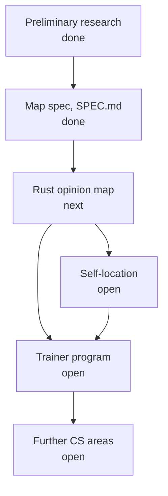

# Overarching task

As of 2026-09-25.

## Goal

Master hard skills in the areas of computer science Arthur cares about, Rust first and then beyond, with speed, efficacy and efficiency. The end state is a practice verifiably aligned with his own values and preferences.

## Starting point

- Rust beginner by hands-on count: one or two apps written by hand.
- Aim: write only Rust whenever nothing forces another language.
- Interest reaches well past the Rust Book and the initial learning curve.
- Current affinities: Amos (fasterthanlime), Tris (No Boilerplate), Greg Johnston (Leptos). Liking them is not taken as alignment with them.
- Written values: [LLM_MANIFESTOS](https://github.com/ryzhakar/LLM_MANIFESTOS). They conflict with each other in places; see Constraints in [SPEC.md](SPEC.md).

## Target domains

All of substantial interest:

- Web
- Distributed systems
- Decentralized systems built on iroh
- Machine learning adjacent to burn and candle
- Desktop CLIs and UIs
- Swift interop on Apple platforms
- Frontend Rust
- Cloud workers in the style of Lambda
- WebAssembly beyond the browser
- Embedded

## Claude's role

An elite personal trainer, available at any hour. Not a mentor.

## The risk the sequence prevents

Discovering, weeks into training, that it proceeds from a valid opinion Arthur does not hold.

## Sequence

| Stage | Status | Produces | Reads |
| --- | --- | --- | --- |
| Preliminary research | done | The questions the spec had to answer; the constraints recorded in SPEC.md | Public sources, Arthur's repositories and manifestos |
| Map spec | done | [SPEC.md](SPEC.md) | Preliminary research, Arthur's decisions |
| Rust opinion map | next | A data layer and a web presentation built from it | SPEC.md |
| Self-location | open | Arthur's own Positions and Values, in the map's vocabulary | The map's data layer, Arthur |
| Trainer program | open | Open | The map's data layer, self-location |
| Further CS areas | open | Open | Open |

## How the map spec embeds

The map is the nearest target. It gives every later stage four things:

- **Vocabulary.** The Language section of SPEC.md is the shared vocabulary for all later artifacts.
- **A readable data layer.** The only guarantee the map makes to the trainer program is that its data layer is readable by it.
- **Independence from Arthur.** Self-location reads the map; Arthur's current preferences never shape how the map is drawn.
- **Domain scope.** Every Question lists the Domains where it is live, so later stages can narrow to the target domains above.

## Principles across all stages

- **Done means complete.** Every stage is actually finished, not started on.
- **Claude alone suffices.** Every step runs with Claude; optional upgrades, such as another company's model as judge, never block completion.

## Open

- Trainer program: curriculum, drills, and how speed, efficacy and efficiency are measured.
- Self-location: its form and method.
- Further CS areas: their order, and whether each gets its own map.
